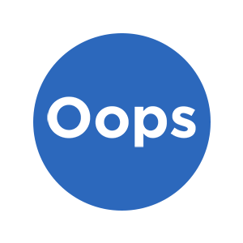
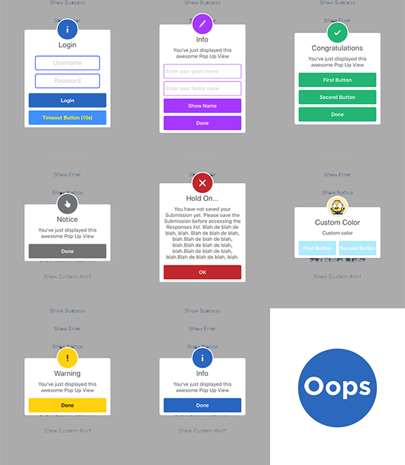

<p align="center">
  
  <br/><a href="https://cocoapods.org/pods/Oops">
  
  
  
  
  <br/>
  
  
  <br/>
  
  
  
  </a>
</p>

## What's this?

`Oops` is a delightful dialog view for iOS written in Swift.

## Requirements

* iOS 8.0+
* Xcode 8 with Swift 3

## Preview



## Installation

#### CocoaPods

```ruby
pod 'Oops'
```

## Contribution

You are welcome to fork and submit pull requests.

## License

`Oops` is open-sourced software, licensed under the `MIT` license.

## Samples

#### Minimum Usage

```swift
import UIKit
import Oops

let kSuccessTitle = "Congratulations"
let kErrorTitle = "Connection error"
let kNoticeTitle = "Notice"
let kWarningTitle = "Warning"
let kInfoTitle = "Info"
let kSubtitle = "You've just displayed this awesome Pop Up View"

let kDefaultAnimationDuration = 2.0

class ViewController: UIViewController {
  @IBAction func showSuccess(_ sender: AnyObject) {
    let alert = Oops()
    alert.addButton("First Button", target: self, selector: #selector(ViewController.firstButton))
    alert.addButton("Second Button") {
      print("Second button tapped")
    }
    alert.showSuccess(kSuccessTitle, subTitle: kSubtitle)
  }

  @IBAction func showError(_ sender: AnyObject) {
    Oops().showError("Hold On...", subTitle:"You have not saved your Submission yet. Please save the Submission before accessing the Responses list. Blah de blah de blah, blah. Blah de blah de blah, blah.Blah de blah de blah, blah.Blah de blah de blah, blah.Blah de blah de blah, blah.Blah de blah de blah, blah.", closeButtonTitle:"OK")
    Oops().showError(self, title: kErrorTitle, subTitle: kSubtitle)
  }

  @IBAction func showNotice(_ sender: AnyObject) {
    let configuration = Oops.Configuration(dynamicAnimatorActive: true)
    Oops(configuration: configuration).showNotice(kNoticeTitle, subTitle: kSubtitle)
  }

  @IBAction func showWarning(_ sender: AnyObject) {
    Oops().showWarning(kWarningTitle, subTitle: kSubtitle)
  }

  @IBAction func showInfo(_ sender: AnyObject) {
    Oops().showInfo(kInfoTitle, subTitle: kSubtitle)
  }

  @IBAction func showEdit(_ sender: AnyObject) {
    let configuration = Oops.Configuration(showCloseButton: true)
    let alert = Oops(configuration: configuration)
    let txt1 = alert.addTextField("Enter your given name")
    let txt2 = alert.addTextField("Enter your family name")
    // alert.addTextView()
    // alert.addTextView()
    alert.addButton("Show Name") {
      print("Text value: \(txt1.text ?? "NA") \(txt2.text ?? "NA")")
    }
    alert.showEdit(kInfoTitle, subTitle:kSubtitle)
  }

  @IBAction func showCustomSubview(_ sender: AnyObject) {
    // Create custom configuration Configuration
    let configuration = Oops.Configuration(
      titleFont: UIFont(name: "HelveticaNeue", size: 20)!,
      textFont: UIFont(name: "HelveticaNeue", size: 14)!,
      buttonFont: UIFont(name: "HelveticaNeue-Bold", size: 14)!,
      showCloseButton: false,
      dynamicAnimatorActive: true
    )
    configuration.shouldAutoDismiss = false

    // Initialize Oops using custom configuration
    let alert = Oops(configuration: configuration)

    // Creat the subview
    let subview = UIView(frame: CGRect(x: 0, y: 0, width: 216, height: 100))
    let x = (subview.frame.width - 180) / 2

    // Add textfield 1
    let textfield1 = UITextField(frame: CGRect(x: x,y: 10,width: 180,height: 40))
    textfield1.layer.borderColor = UIColor.green.cgColor
    textfield1.layer.borderWidth = 1.5
    textfield1.layer.cornerRadius = 5
    textfield1.placeholder = "Username"
    textfield1.textAlignment = NSTextAlignment.center
    subview.addSubview(textfield1)

    // Add textfield 2
    let textfield2 = UITextField(frame: CGRect(x: x, y: textfield1.frame.maxY + 10, width: 180, height: 40))
    textfield2.isSecureTextEntry = true
    textfield2.layer.borderColor = UIColor.blue.cgColor
    textfield2.layer.borderWidth = 1.5
    textfield2.layer.cornerRadius = 5
    textfield1.layer.borderColor = UIColor.blue.cgColor
    textfield2.placeholder = "Password"
    textfield2.textAlignment = NSTextAlignment.center
    subview.addSubview(textfield2)

    // Add the subview to the alert's UI property
    alert.customSubview = subview
    alert.addButton("Login") {
      print("Logged in")
      alert.hideView()
    }

    // Add Button with visible timeout and custom Colors
    let showTimeout = Oops.Button.ShowTimeoutConfiguration(prefix: "(", suffix: "s)")
    alert.addButton("Timeout Button", backgroundColor: UIColor(red:0.26, green:0.56, blue:1.00, alpha:1.00), textColor: UIColor.yellow, showTimeout: showTimeout) {
      print("Timeout Button tapped")
    }

    let timeoutValue: TimeInterval = 10.0
    let timeoutAction: Oops.TimeoutConfiguration.ActionClosure = {
      print("Timeout occurred")
    }

    alert.showInfo("Login", subTitle: "", timeout: Oops.TimeoutConfiguration(timeoutValue: timeoutValue, timeoutAction: timeoutAction))
  }

  @IBAction func showCustomAlert(_ sender: AnyObject) {
    let configuration = Oops.Configuration(
      titleFont: UIFont(name: "HelveticaNeue", size: 20)!,
      textFont: UIFont(name: "HelveticaNeue", size: 14)!,
      buttonFont: UIFont(name: "HelveticaNeue-Bold", size: 14)!,
      showCloseButton: false,
      dynamicAnimatorActive: true,
      buttonsLayout: .horizontal
    )
    configuration.circleIconHeight = configuration.circleHeight
    // configuration.shouldAutoDismiss = false

    let alert = Oops(configuration: configuration)
    alert.addButton("First Button", target: self, selector: #selector(ViewController.firstButton))
    alert.addButton("Second Button") {
      print("Second button tapped")
    }
    alert.addButton("Third Button") {
      print("Third button tapped")
    }

    let color = UIColor(red:0.69, green:0.92, blue:1.00, alpha:1.00)
    alert.showCustom("Custom Color", subTitle: "Custom color", color: color, icon: #imageLiteral(resourceName: "avatar"))
  }

  func firstButton() {
    print("First button tapped")
  }
}
```
